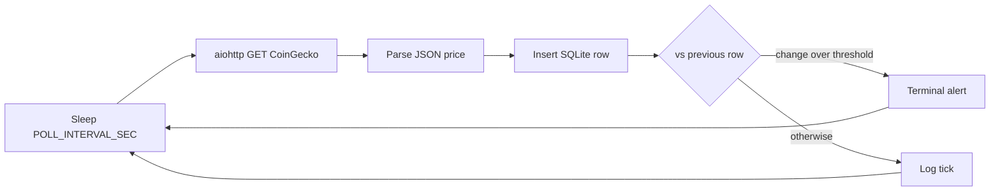
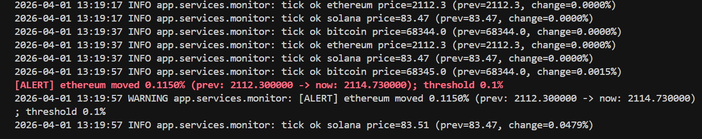
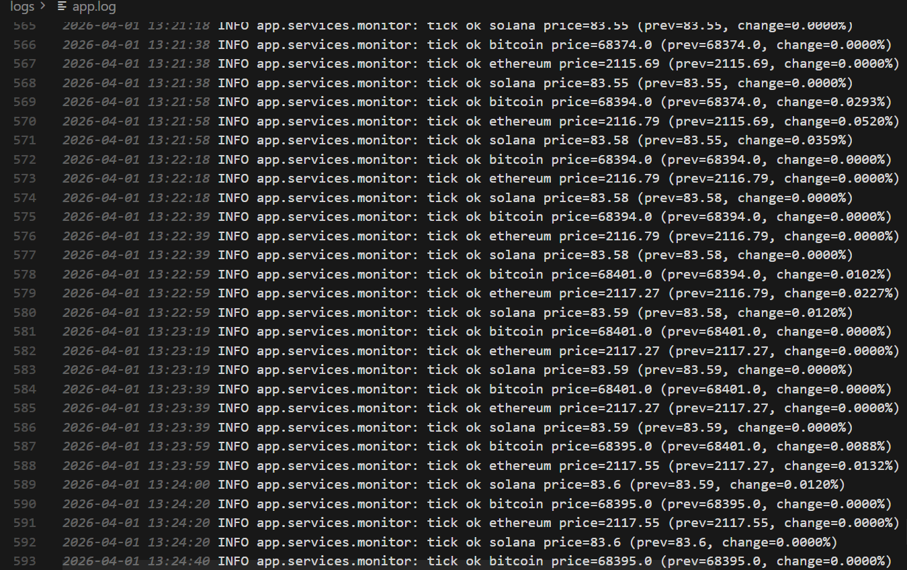
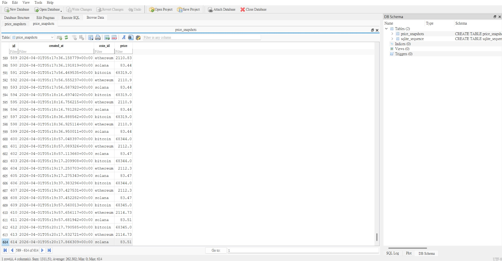

# Async Price / Inventory Monitor Engine

[](https://github.com/Lucien0420/async-crypto-price-monitor/actions/workflows/ci.yml)

**Repository:** [github.com/Lucien0420/async-crypto-price-monitor](https://github.com/Lucien0420/async-crypto-price-monitor)

## Overview

**Async Price / Inventory Monitor Engine** is a small **asyncio** + **aiohttp** worker that polls a public **CoinGecko** price API on a fixed interval, writes time-stamped snapshots to **SQLite**, and prints a **terminal alert** (ANSI) when the latest price moves more than a configurable percentage compared to the **previous stored row for that coin**.

### Core Features

- **Multi-coin per round**: set **`COIN_IDS=bitcoin,ethereum,...`** — **one HTTP GET** returns all requested coins; each coin is written and checked against its own history
- **Non-blocking I/O**: `asyncio` event loop + `aiohttp` for HTTP; `aiosqlite` for async SQLite access
- **SQLite persistence**: `price_snapshots` table (timestamp, coin id, price)
- **Threshold alerts**: colored terminal warning when absolute % change vs. previous row exceeds config
- **CoinGecko limits**: retries on **HTTP 429** with backoff; optional **Demo API key** via `x-cg-demo-api-key`
- **Logging**: stdout + rotating **`logs/app.log`** (size-capped; log files gitignored)
- **Tests**: `pytest` + **aioresponses** (HTTP mocked; no live API in CI)
- **Docker**: `Dockerfile` + `docker-compose` with volumes for `data/` and `logs/`
- **Graceful shutdown**: on Linux / in containers, **SIGTERM** / **SIGINT** cancel the monitor loop (`docker stop` friendly)

### Use Cases

- Portfolio demos of async polling, persistence, and API rate-limit handling
- Lightweight price-monitoring prototypes (inventory hooks can extend the same DB layer later)
- Background worker pattern comparable to inbound webhook services—**outbound** polling instead of **inbound** HTTP

### Design

- **Layered layout**: `app/core` (settings from `.env`), `app/database` (SQLite), `app/services` (monitor loop + fetch)
- **Configuration**: `python-dotenv`; runtime deps **pinned** in `requirements.txt` for reproducible installs
- **Entry point**: `main.py` adds the project root to `sys.path` so `import app` resolves reliably when multiple projects exist on one machine

### Monitor flow



---

## Quick Start

### Option 1: Local (recommended for development)

```bash
git clone https://github.com/Lucien0420/async-crypto-price-monitor.git
cd async-crypto-price-monitor
python -m venv .venv
.venv\Scripts\activate   # Windows
# macOS/Linux: source .venv/bin/activate
pip install -r requirements.txt
copy .env.example .env   # Windows — optional; edit COIN_ID, POLL_INTERVAL_SEC, etc.
python main.py
```

Use **Ctrl+C** to stop. Logs go to **stdout** and **`logs/app.log`**.

**Dev / test dependencies:**

```bash
pip install -r requirements-dev.txt
pytest -v
```

### Option 2: Docker

```bash
docker compose build
docker compose up -d
```

- **Data**: host `./data` → container `/app/data` (SQLite file).
- **Logs**: host `./logs` → `/app/logs`.
- To load a local env file, uncomment `env_file: .env` in `docker-compose.yml` (and keep `.env` at the project root).

`docker stop` sends **SIGTERM**; the worker cancels the asyncio task and exits.

---

## Demo

### 1. Automated tests (no network)

```bash
pip install -r requirements-dev.txt
pytest -v
```

CoinGecko HTTP is **mocked** with **aioresponses**; no API key required.

### 2. Live monitor (real API)

```bash
python main.py
```

Watch log lines; when the price change vs. the previous snapshot exceeds **`PRICE_ALERT_THRESHOLD_PERCENT`**, a **red** terminal message is printed.

### 3. Visual example (multi-coin run)

Order follows the **same flow as production**: terminal output, structured log, then persisted rows in SQLite. Example: `COIN_IDS=bitcoin,ethereum,solana`, ~20s between rounds; Ethereum crosses the configured threshold (red `[ALERT]`).

**Terminal**



**Structured log** — `logs/app.log` (INFO `tick ok` lines):



**SQLite** — table `price_snapshots` in DB Browser for SQLite (one database, multiple `coin_id` values):



---

## Environment Variables

| Variable | Description | Default |
|----------|-------------|---------|
| `COIN_IDS` | Comma-separated CoinGecko ids (e.g. `bitcoin,ethereum`) — **one HTTP request** fetches all coins each round | *(see `COIN_ID`)* |
| `COIN_ID` | Used only if `COIN_IDS` is unset: single coin id | `bitcoin` |
| `VS_CURRENCY` | Quote currency | `usd` |
| `POLL_INTERVAL_SEC` | Seconds between **full poll rounds** (all `COIN_IDS` in one request per round). Without a Demo API key, **~20–30s or higher** is safer; values in the low teens often hit **429** | `30` |
| `PRICE_ALERT_THRESHOLD_PERCENT` | Alert if abs % change vs previous row exceeds this | `1.0` |
| `DATABASE_PATH` | SQLite path (relative to project root unless absolute) | `data/monitor.db` |
| `COINGECKO_API_KEY` | Optional CoinGecko Demo API key (`x-cg-demo-api-key` header) | *(empty)* |

Copy **`.env.example`** to **`.env`** and adjust. Database files under `data/` and log files under `logs/*.log` are gitignored.

---

## SQLite storage (multiple coins)

One **SQLite file** (default `data/monitor.db`), one table `price_snapshots`. Each row has a **`coin_id`** column, so **bitcoin, ethereum, …** all live in the same database; each coin’s **alert** compares only against the **previous row for that same `coin_id`**.

## CoinGecko rate limits (HTTP 429)

The free public API enforces per-IP / per-minute limits. Polling too aggressively—or sharing the IP with other clients—can return **429 Too Many Requests**. The code **waits and retries**; if limits persist, increase **`POLL_INTERVAL_SEC`** and/or set **`COINGECKO_API_KEY`** (Demo tier).

**Practical guideline (not an official quota):** with **no** `COINGECKO_API_KEY`, keep **`POLL_INTERVAL_SEC` ≥ ~20** (default **30** is a reasonable baseline). CoinGecko may change limits; more coins per request does **not** multiply calls per round (one GET per round), but a very short interval still risks 429.

---

## CI (GitHub Actions)

On push or pull request to `main` / `master`, `.github/workflows/ci.yml` runs **pytest** on Python **3.10** and **3.12**. Tests mock CoinGecko HTTP; no API key required. The badge above reflects the latest run on the default branch after you push.

---

## Deployment notes

### Windows Task Scheduler

Point the action at your venv’s **`python.exe`**, argument **`main.py`**, and set **Start in** to the **project root** so `.env` loads from the working directory.

### Docker Desktop (Windows)

Install **Docker Desktop**, then run the **Docker** quick start from the project directory.

---

## Project Structure

```
├── app/
│   ├── core/          # Settings from .env
│   ├── database/      # SQLite helpers
│   └── services/      # Monitor loop, CoinGecko fetch
├── data/              # SQLite (typically gitignored)
├── logs/              # app.log rotation (gitignored *.log)
├── tests/
├── docs/
│   └── images/        # README visual examples (PNGs)
├── .github/workflows/ # CI
├── main.py
├── Dockerfile
├── docker-compose.yml
├── requirements.txt
├── requirements-dev.txt
└── pytest.ini
```

---

## Dependency pinning

- **`requirements.txt`**: runtime libraries with **pinned versions**.
- **`requirements-dev.txt`**: `-r requirements.txt` plus **pytest**, **pytest-asyncio**, **aioresponses**.

---

## License

MIT License — see [LICENSE](LICENSE) for details.
